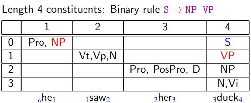

# Foundations of Natural Language Processing - Lecture Notes

Written by [Bora M. Alper](https://boramalper.org) in 2020 based on the lecture slides at https://www.inf.ed.ac.uk/teaching/courses/fnlp/.

[toc]

## 14 January 2020

- Syntax, Part of Speech, Words, Morphology, Semantics, and Discourse

  
- Why NLP is hard?
  - Because there **ambiguity** at many levels:
    1. **Word senses:** "bank" (finance or river?)
    2. **Part of Speech:** "chair" (noun or verb?)
    3. **Syntactic structure:** "I saw a man with a telescope" (did you use a telescope to saw the man or did the man have a telescope?)
    4. **Quantifier scope:** "Every child loves some movie" (there exist a movie that every child loves or every child loves at least one movie)
    5. **Multiple:** "I saw her duck" (you saw her ducking or you saw a duck that she had)
    6. **Reference:** "John dropped the goblet onto the glass table and it broke" (what broke?)
    7. **Discourse:** "The meeting is cancelled. Nicholas isn't coming to the office today." (is the meeting cancelled because he isn't coming or is he not coming because the meeting is cancelled?)
- There are two ways of dealing with ambiguity:
  - Non-probabilistic methods, returning *all* possible answers
    - e.g. FSMs for morphology, CKY parsers for syntax
  - Probabilistic methods returning *the best* possible analysis
    - e.g. HMMs for PoS tagging, PCFGs for syntax, Viterbi, probabilistic CKY
    - The best analysis is only good if our model's probabilities are accurate; so where do accurate probabilities com from?
- Statistical NLP
  - Like most other parts of AI, NLP today is dominated by statistical methods
  - Typically more robust than earlier rule-based methods
  - Probabilities are *learned* from data
    - Usually requires *lots of data* about any particular phenomenon
- Why NLP is hard again?
  - **Zipf's Law**

    

    - The frequency of a word is inversely proportional to its rank in the frequency table (and it's also exponential!)
      $ f \times r \approx k $
      - $f$ for frequency, $r$ for rank, and $k$ for constant
      - So that the most common word, say "the", occurs 1m times in a corpus whereas the 20th most common word, say "do", occurs only 200k times.
    - It's a natural phenomenon that is observed in other languages and other fields as well.
    - Regardless of the size of your corpus!
    - Can also be observed for other linguistic structure (e.g. syntactic rules in a CFG).
    - ==These mean that we need to find clever ways to estimate probabilities for things we have rarely or never seen during training.==

  - **Variation**

    - Suppose we train a Part of Speech tagger on the Wall Street Journal, which is nice and neat and copy-edited.

    - What will happen if we try to use this tagger for social media?

      > ikr smh he asked fir yo last name

  - **Expressivity**

    - Not only can one form have different meanings (ambiguity) but the same meaning can be expressed with different forms:
      - *She gave the book to Tom* vs. *She gave Tom the book*
      - *Some kids popped by* vs. *A few children visited*
      - *Is that window still open* vs. *Please close the window*

  - **Context Dependence**

    - Last example also shows that the correct interpretation is context-dependent and often requires world knowledge (that the person is angry for instance)

## 17 January 2020

### Corpora

- A **corpus** is a body of utterances, as words or sentences, assumed to be *representative* of and used for lexical, grammatical, or other linguistic analysis.
- To understand and model how language works, we need empirical evidence. Ideally, this should be **naturally-occurring** corpora.
- Aside from utterances, corpus datasets include **metadata**  -- side information about where the utterances come from, such as author, date, topic, publication, etc.
- Corpora with **linguistic annotations** are of particular interest for *core NLP* and therefore this course, where humans have read the text and marked categories and/or structures describing their syntax and/or meaning.
  - Can be derived automatically from the original data artifact (such as star ratings) too.
  - Consistency of human annotators is a big issue. Unambiguous rules are required to resolve disagreements.

### Sentiment Analysis

- Goal predict the *opinion* expressed in a piece of text.
  - Either *positive* or *negative*
  - Or a *rating* on a scale
- The simplest way is to count the number of words with positive and negative denotations/connotations.

#### Building a Sentiment Analyser

1. What is the input for each prediction?
   Sentence? Full review text? Text + metadata?
2. What are the possible outputs?
   \+ or -? stars?
3. How will it decide?
   - When a system's behaviour is determined solely by manual rules or databases, it is said to be **rule-based**, **symbolic**, or **knowledge-driven** (early days of computational linguistics)
   - **Learning** is the act of collecting statistics or patterns automatically from corpora to govern the system's behaviour (dominant in most areas of contemporary NLP)
     - **Supervised learning** is when the data provides example input-output pairs (main focus of this course)
     - Core behaviour: **training**
       Refining behaviour: **tuning**
4. How will you measure its effectiveness?

The last one, at least, requires data!

- BEFORE you build a system, choose a dataset for evaluation.
- Why is data-driven evaluation is important?
  - Good science requires controlled experimentation.
  - Good engineering requires benchmarks.
  - Your intuitions about typical inputs are probably wrong.
- Often you should have multiple evaluation datasets: one for *development* as you hack on your system, and one reserved for FINAL *testing*.
  - So that we don't optimise for the benchmark only! (for instance by overfitting)
- **Gold labels:** Correct labels
- **Evaluation**
  - Simplest measure:
    $$ \text{accuracy} = \frac{\text{# correct}}{\text{# total}} $$

#### A Simple Sentiment Classification Algorithm

- Use a **sentiment lexicon** to count positive and negative words:


  

  - Simplest rule: Count positive and negative words in the input. Predict whichever is greater.
- **Problems:**
  1. Hard to know whether words that *seem* positive or negative tend to actually be used that way:
     - sense ambiguity
      e.g. "It was awfully beautiful."
     - sarcasm / irony
      e.g. "Oh yeah it was definitely wonderful!"
     - text could mention expectations or opposing viewpoints, in contrast to author's actual opinion
      e.g. "I was expecting a great movie as my friends described it as a brilliant classic but I think it was just awful."
  2. Opinion words may be describing for example a character's attitude rather than being an evaluation of the film.
  3. Some words act as semantic modifiers of other opinion-bearing words/phrases so interpreting the full meaning requires sophistication:
     - I **can't** stand this movie
     - I **can't** *believe how* great this movie is
  - To address \#1:  A data-driven method: Use **frequency counts** from a *training corpus* to ascertain which words tend to be positive or negative.

### Preprocessing & Normalisation

- Normal written conventions often do not reflect the "logical" organisation of textual symbols.
  - For example, some punctuation marks are written adjacent to the previous or following word, even though they are not part of it.
  - The details vary according to language and style guide even!
- Given a string of raw text, a **tokeniser** adds logical boundaries between separate words/punctuation **tokens** (occurrences) not already separated by spaces:

  
  
  - To a large extent, this can be automated by rules. But there are always difficult cases (e.g. "C-3PO").
- English tokenisation conventions vary somewhat ---e.g., with respect to:
  - **clitics** (contracted forms): *'s*, *n't*, *'re*, etc.
  - hyphens in compounds like *president-elect*
- Word-level tokenisation is just part of the larger process of preprocessing or normalisation, which may also include
  - encoding conversion
  - removal of markup
  - *insertion* of markup
  - ==case conversion==
  - sentence boundary detection
    - Called **sentence tokenisation**
- It should be evident that *a large number of decisions have to be made*, many of them dependent on the eventual intended use of the output, before a satisfactory preprocessor for such data can be produced.
  - *Documenting* those decisions and their implementation is then a key step in establishing the credibility of any subsequent experiments.
    - Documentation is especially important if the dataset is to be distributed publically.

### Choice of Training & Evaluation Data

- We know that the way people use language varies considerably depending on **context**. Factors include
  - **Mode of Communication**
    Speech (in person, telephone, ...), writing (print, SMS, Web, ...)
  - **Topic**
    Chit-chat, politics, sports, physics, ...
  - **Genre**
    News story, novel, Wikipedia article, persuasive essay, political address, tweet, ...
  - **Audience**
    Formality, politeness, complexity (e.g. child-directed speech), ...
  - In NLP, **domain** is a cover-term for all these factors.
- Statistical approaches typically assume that the training data and the test data are sampled from the same distribution.
  - I.e. if you saw an example data point, it would be hard to guess whether it was from the training or test data
- Things can go awry if the test data is appreciably different, e.g.
  - different tokenisation conventions
  - new vocabulary
  - longer sentences
  - more colloquial / less edited style
  - different distribution of labels
- **Domain adaptation** techniques attempt to correct for this assumption when something about the source/characteristics of the test data is known to be different.

## 21 January 2020

- **Probability of a sentence** is "how likely is it to occur in natural language"
  - Consider only a specific language (English) [or even British English]
  - Not including meta-language (e.g. linguistic discussion)
  - P("the cat slept peacefully") > P("slept the peacefully cat")
    - Use case: generative NLP (abstractive summarisation)
  - P("she studies morphosyntax") > P("she studies more faux syntax")
    - Use case: audio transcription
- It's very difficult to know the true probability of an arbitrary sequence of words.
- But we can define a **language model** to give us good *approximations*.
- Like all models, language models will be good at capturing *some* things and *less good for others*.
  - We might want different models for different tasks.
  - Today, one type of language model: an **n-gram model**

### Use Cases of a Language Model

#### Spelling Correction

- Sentence probabilities help decide correct spelling


#### Automatic Speech Recognition

- Sentence probabilities help decide between similar-sounding options.


#### Machine Translation

- Sentence probabilities help decide word choice and word order.


#### Prediction

- Language models can be used for **prediction** as well as correction.
- E.g. Predictive text correction/completion on your mobile phone:
  - Keyboard is tiny, easy to touch a spot slightly off from the letter you meant.
  - Want to correct such errors as you go, and lso provide possible completions.
  - Predicts as you are typing: `ineff...`
  - In this case, a language model may be defined over sequences of *characters* instead of  (or in addition to) sequences of *words*.

### Estimating Probabilities

- We want to know the probability of word sequence $\vec{w} = w_1 \ldots w_n$ occurring in English.
- Assume we have some **training data**: large corpus of general English text.
- We can use this data to **estimate** the probability of $\vec{w}$ (even if we never see it in the corpus!)

#### Probability Theory vs Estimation

- Probability theory can solve problems like
  - I have a jar with 6 blue marbles and 4 red ones.
  - If I choose a marble uniformly at random, what's the probability that it's red?
- But often we don't know the *true probabilities*, only have data:
  - I have a jar of marbles
  - I repeatedly choose a marble uniformly at random and then replace it before choosing again.
  - In ten draws, I get 6 blue marbles and 4 red ones.
  - On the next draw, what's the probability that I get a red marble?
  - First three facts are **evidence**.
  - The question requires estimation theory.

#### Notation

- $P(x)$ for *true* probabilities
- $\hat{P}(x)$ for *estimated* probabilities
- $P_E(x)$ for *estimated* probabilities using a particular *estimation method* $E$.
- But since we almost always mean estimated probabilities, we might get lazy later and use $P(x)$ for those too.

#### Relative Frequency Estimation

- Intuitive way to estimate discrete probabilities
  $$P_{\text{RF}}(x) = \frac{C(x)}{N} $$
  where
  - $C(x)$ is the count of $x$ in a large dataset, and
  - $N = \sum_{x'}C(x')$ is the total number of items in the dataset

- This method is also known as **maximum-likelihood estimation (MLE)** for reasons we'll explain.

##### Problems

- Using MLE on full sentences doesn't work well for language model estimation.
  - All sentences that have never occurred get zero probability even if they are grammatical (and meaningful).
- In general, MLE thinks anything that *hasn't* occurred *will* never occur (P=0).
  - Clearly not true! Such things can have *differing* and *non-zero* probabilities.
    - My hair turns blue.
    - I ski a black run.
    - I travel to Finland.
  - And similarly for word sequences that have never occurred.

##### Sparse Data

- In fact, even things that occur once or twice in our training data are a problem.
- The sparse data problem is that there are **not enough observations to estimate probabilities well simply by counting observed data**.
- For sentences, many (most!) will occur rarely if ever in our training data. So we need to do something far smarter.

#### N-Gram Models

- One way to tackle sparse data problem is to estimate $P(\vec{w})$ by combining the probabilities of *smaller parts* of the sentence, which will occur more frequently.
- This is the intuition behind **n-gram language models**.

##### Deriving an N-Gram Model

$$\begin{align}
&P(S=``\text{the cat slept quitely}'')\\
=\ &P(\text{the}, \text{cat}, \text{slept}, \text{quitely})\\
=\ &P(\text{quitely} \mid \text{the}, \text{cat}, \text{slept}) \times P(\text{the}, \text{cat}, \text{slept})\\
=\ &P(\text{quitely} \mid \text{the}, \text{cat}, \text{slept}) \times P(\text{slept} \mid \text{the}, \text{cat}) \times P(\text{the}, \text{cat})\\
\vdots
\end{align}$$

- More generally, we use the chain rule.
- But many of these conditional probabilities are just as sparse!
  - If we want $P(\text{the}, \text{cat}, \text{slept}, \text{quitely})$
  - We still need $P(\text{quitely} \mid \text{the}, \text{cat}, \text{slept})$
- So we make an **independence assumption**: the probability of a word only depends on a *fixed* number of previous words (called **history**)
  - **Trigram** model: $P(w_i \mid w_1, w_2, \ldots, w_{i-1}) \approx P(w_i \mid w_{i-2}, w_{i-1})$
  - **Bigram** model: $P(w_i \mid w_1, w_2, \ldots, w_{i-1}) \approx P(w_i \mid w_{i-1})$
  - **Unigram** model: $P(w_i \mid w_1, w_2, \ldots, w_{i-1}) \approx P(w_i)$
- This assumption is not always a good one! But it does reduce the sparse data problem.
- If we use MLE, we consider:
  - Out of all cases where we saw $w_{i-2}, w_{i-1}$ (in order) as the first two words of a trigram,
  - how many had $w_i$ as the third word?

##### Beginning/End of Sequence

- To capture behaviour at beginning/end of sequences, we can augment the input with `<s>` and `</s>`.
- Alternatively, we can model all sentences as one (very long) sequence, including punctuation.

##### Costs (Negative Log Probabilities)

- Word probabilities are typically very small.
- Multiplying lots of small probabilities quickly gets so tiny that we cannot represent the numbers accurately, even with double precision floating point.
- So in practice, we typically use **negative log probabilities** (also called **costs**)
  - Since probabilities range from 0 to 1, negative log probabilities range from 0 to $\infty$
  - ==*lower* cost = *higher* probability==
  - Instead of *multiplying* probabilities, we *add* negative log probabilities

##### Problems

- N-gram models can be too simplistic, length of a "context" often varies: can be shorter or longer than an arbitrary $N$.
  - Longer histories may capture more but are also more sparse.
- Still suffers from assigning zero probabilities to not-seen sequences.

## 24 January 2020

### Evaluating a Language Model

- Intuitively, a trigram model captures more context than a bigram model, so should be a "better" model.
  - That is, it should *more accurately predict the probabilities of sentences*.
  - But how can we measure this?

### Types of Evaluation in NLP

- **Extrinsic**: measure performance on a downstream application
  - For a language model, plugging it into a machine translation, automated speech recognition, ... system
  - ==The most reliable evaluation==, but can be time-consuming
  - And of course, we still need an evaluation measure for the downstream system!
- **Intrinsic**: design a measure that is *inherent* to the current task
  - Can be much quicker/easier during development cycle
  - But not always easy to figure out what the right measure is
    - ==ideally, one that correlates well with extrinsic measures==
- Let's consider how to define an intrinsic measure for language models.

### Entropy

$$ H(X) = \sum_x -P(x) \log_2{P(x)} = E[-\log_2P(X)] $$

- Intuitively, a measure of uncertainty/disorder
  
  - A measure of "how surprising" a probability distribution is.
- Example: where the area of a section is proportional to its probability

  

#### Entropy as Yes/No Questions

- Entropy is the answer to ==how many yes-no questions (bits) do we need to find out the outcome== (or to *encode* the outcome)?
- **Uniform distributions** with $2^n$ outcomes require $n$ yes-no questions.
- Average number of bits needed to encode $X$ $\ge$ entropy of $X$

#### Estimates and Cross Entropy

- A good model should have low uncertainty (entropy) about what comes next.
  - Lower cross entropy means that a model is better at predicting the next element (e.g. word).
- **Cross entropy** measures how close $\hat{P}$ (estimate) is to $P$ (true):
  $H(P, \hat P) = \sum_x -P(x) \log_2\hat P(x)$
- ==Note that cross-entropy $\ge$ entropy==
  - A model's uncertainty can be no less than the true uncertainty.
  - But we still don't know $P(x)$

##### Estimating Cross Entropy

For $w_1, \ldots, w_n$ with large $n$, per-word cross-entropy is well approximated by:

$$ H_M(w_1, \ldots, w_n) = -\frac 1 n \log_2 P_M(w_1, \ldots, w_n) $$

- That is just the average negative log probability our model assigns to each word in the sequence (i.e. normalised for sequence length).

### Perplexity

- Language model performance is often reported as **perplexity** rather than cross-entropy.
- Perplexity is simply $2^\text{cross-entropy}$.
  - The average branching factor at each decision point is 2, if our distribution were uniform.
  - So, 6 bits of cross-entropy means our model perplexity is $2^6 = 64$: equivalent uncertainty to a uniform distribution over 64 outcomes.

### Interpreting Measures

- Cross entropy of a language model **on some corpus** is 5.2
- Is this *good*?
- No way to tell! **Cross entropy** depends on both *the model* and *the corpus*.
  - **Some language is simply more predictable** (e.g. casual speech vs academic writing)
    - So lower cross entropy could mean that the corpus is "easy", rather than the model is good.
  - ==We can only compare different models on the same corpus.==
    - Measured on "held-out" data.

### Sparse Data, Again

- Remember that MLE assigns zero probability to never observed sequences.
- Meaning that cross-entropy would be infinite: because of $\log_2 0$
- Basically right: our model says the something should *never* occur, so our model is infinitely wrong (or rather, we are infinitely surprised) when it does occur!
- Even with a unigram model we will run into words we never saw before. So even with short(est) n-grams, we need better ways to estimate probabilities from sparse data.

### Smoothing

- The flaw of MLE is that it estimates probabilities that make the training data maximally probable, by making everything else (i.e. unseen data) minimally probable.
- **Smoothing** method**s** address the problem by stealing probability mass from seen events and (_somehow_) reallocating it to unseen events.
- There are lots of different methods based on different kinds of assumptions.
- ==In smoothing, we have to ensure that all the probabilities still sum up to 1.==

#### Add-One (Laplace) Smoothing

- Just pretend we saw everything one more time than we did.

$$ P_{+1}(w_i \mid w_{i-2}, w_{i-1}) = \dfrac{C(w_{i-2}, w_{i-1}, w_i) + 1}{C(w_{i-2}, w_{i-1}) + v} $$

where $v$ is the vocabulary size.

###### Problems

- Laplace smoothing steals *way* too much from seen events.
  - In fact, MLE is pretty good for frequent events, so we shouldn't want to change these much.
- Assumes that we know the vocabulary size in advance.
  - And also that the size of our vocabulary is fixed.
  - To remediate, we can just add a single "unknown" (UNK) item, and use this for all unknown words.

##### Add-α (Lidstone) Smoothing

- We can improve things by adding $\alpha < 1$

$$  P_{+\alpha}(w_i \mid w_{i-2}, w_{i-1}) = \dfrac{C(w_{i-2}, w_{i-1}, w_i) + \alpha}{C(w_{i-2}, w_{i-1}) + \alpha v}  $$

##### Good-Turing Smoothing

- Good is the surname of Irving John Good. :)
- Previous methods changed the denominator, which can have big effects even on frequent events.
- ==Good-Turing changes the numerator only.==
- Think of Good-Turing like this:
  - MLE divides count $c$ of n-gram by count $n$ of history:
    $ P_\text{ML} = \dfrac c n $
  - Good-Turing uses **adjusted counts** $c^*$ instead:
    $P_\text{GT} = \dfrac {c^*} n$
- The actual formula is skipped for brevity. I don't think it's actually needed.
  - Refer to 04_slides.pdf page 32 when needed.
- There are even better methods!

## 28 January 2020

### Problems with Good-Turing

- Assumes we know the vocabulary size (i.e. no unseen words)
  - Use UNK
- Does not allow "holes" in the counts (i.e. if $N_i > 0$ then $N_{i-1}>0$)
  - Use linear regression
- Applies discounts even to high-frequency items
- ==Assigns equal probabilities to all unseen events==
  - A better solution is to **use information from lower order N-grams (shorter histories)**
    - beer drinkers [likely]
    - beer eaters [unlikely]
  - Two methods:
    - **interpolation**
    - **backoff**

### Interpolation

- **Combine** higher and lower order N-gram models, since they have different strengths and weaknesses:

  - **high-order** N-grams are **sensitive to more context**, but have **sparse** counts
  - **low-order** N-grams have **limited context** but **robust** counts

- If $P_N$ is N-gram estimate (from MLE, GT, etc; $N = 1 \text{ to } 3$), use:

  $P_\text{INT}(w_3 \mid w_1, w_2) = \lambda_1 P_1(w_3) + \lambda_2 P_2(w_3 \mid w_2) + \lambda_3P_3(w_3 \mid w_1, w_2) $

  - E.g. $P_\text{INT}(\text{three} \mid \text{I}, \text{spent}) = \lambda_1 P_1(\text{three}) + \lambda_2 P_2(\text{three} \mid \text{spent}) + \lambda_3P_3(\text{three} \mid \text{I}, \text{spent}) $

- ==Nota bene that all $\lambda_i$s must sum to 1!==

#### Fitting Interpolation Parameters

- In general, any weighted combination of distributions is called a **mixture model**.
- So $\lambda_i$s are **interpolation parameters** or **mixture weights**.
- The values of the $\lambda_i$s are chosen to optimise perplexity on a held-out dataset.

### Katz Back-Off

- Solve the problem in a similar way to Good-Turing smoothing.
- Discount the trigram-based probability estimates.
- This leaves some probability mass to share among the estimates from the lower-order models.
- Instead of distributing the mass *uniformly* over unseen items, use it for **backoff estimates**
- No need to know the formula.

### Diversity of Histories

- "York" almost always directly follows "New", say in a corpus
- So, in unseen bigram contexts, York should have low probability
  - lower than predicted by unigram model as used in interpolation/backoff.

### Kneser-Ney Smoothing

- Kneser-Ney smoothing takes diversity of histories into account
- Count of distinct histories for a word
  $$ N_{1+}(\cdot w_i) = |\{w_{i-1}: c(w_{i-1}, w_i) > 0\}| $$
  - In the formula above, $w_{i-1}$ is the history (i.e. bigram model).
- Recall: MLE of unigram language model
  $$ P_\text{ML}(w_i) = \dfrac{C(w_i)}{\sum_w C(w)} $$
- In KN smoothing, replace raw counts with count of histories:
  $$P_\text{KN}(w_i) = \dfrac{N_{1+}(\cdot w_i)}{\sum_w N_{1+}(\cdot w)} $$
- The best thing about KN smoothing is that it gives you the probability of "appearing in new contexts"

#### Kneser-Ney In Practice

- Original version used backoff, later "modified Kneser-Ney" introduced using interpolation.
- Fairly complex equations, but until recently ==the best smoothing method for word n-grams==

### Distributed Representations and Word Similarity

**SKIPPED.** See 05_slides.pdf page 19.

- E.g. Word2Vec
- Use neural networks to project words into a continuous space, so words that appear in similar contexts have similar representation.
- Can $P(\text{salmon} \mid \text{caught}, \text{two})$ tell us anything about $P(\text{swordfish}\mid \text{caught}, \text{two})$?
  - N-gram models say no.
  - But we know that both are fish and can be caught.

### Noisy Channel

- We imagine that someone tries to communicate a sequence to us, but noise is introduced. We only see the output sequence


| Application         | Y              | X               |
| ------------------- | -------------- | --------------- |
| Speech Recognition  | spoken words   | acoustic signal |
| Machine Translation | words in $L_A$ | words in $L_B$  |
| Spelling Correction | intended words | typed words     |

- $P(Y)$ is the language model!
- $P(X \mid Y)$ is the distribution describing the "likelihood" of the output given the intention. We call it the **noise model**.
- $P(X)$ is the resulting distribution over what we actually see.
- ==Given some particular observation $x$, we want to recover the most probable $y$ that was intended.==

#### Noisy Channel as Probabilistic Inference

- Mathematically, what we want is $\arg\max_y P(y \mid x)$
- Rewrite using Bayes' Rule:
  $$\begin{align}\arg\max_y P(y\mid x) &= \arg\max_y \dfrac{P(x\mid y)P(y)}{P(x)}\\
  &= \arg\max_y P(x\mid y)P(y)
  \end{align}$$
  - $P(x\mid y)$ is the noise model
    - varies heavily depending on the application: acoustic model, translation model, misspelling model, ...
  - $P(y)$ is the language model
    - fairly same for different applications
- Training conditional probabilities requires *input/output pairs* which are often limited:
  - Misspelled words with their corrections, transcribed speech, translated text, ...
- But language models can be trained on *huge unannotated* corpora: a better model! Can help improve overall performance.
- Assume we have a way to compute $P(x\mid y)$ and $P(y)$. Can we do the following:
  - Consider all possible intended words $y$.
  - For each $y$, compute $P(x\mid y)P(y)$.
  - Return the $y$ with highest $P(x\mid y)P(y)$ value.
  - **No!** Without constraints, there are (nearly) infinite number of possible $y$s.

## 31 January 2020

### Edit Distance

- The task: find the **optimal character alignment** between two words (the one with the fewest character changes: the **minimum edit distance** or MED).

- Example: *if all changes count equally*, MED(stall, table) is 3:

  ```
  S T A L L
    T A L L		deletion
    T A B L   	substitution
    T A B L E		insertion
  ```

  - Written as an alignment:

    ```
    S T A L L -
    d | | s | i
    - T A B L E
    ```

- **There may be multiple best alignments**

  - And **lots** of *non-optimal* alignments.

- For now, all costs are equal:
  cost(ins) = cost(del) = cost(sub) = 1

  - But we can choose whatever costs we want! They can even depend on the particular characters involved.

#### Finding an Optimal Alignment

- Brute force doesn't scale well.
  - The number of alignments to check grows exponentially with the length of the sequences.
- Instead we will use *dynamic programming* algorithm.
  - Strings of length $n$ and $m$ require $O(mn)$ time and $O(mn)$ space.

##### Chart


- $\text{Chart}[i, j]$ stores two things:
  - $D(\text{stall}[0..i], \text{table}[0..j])$: the MED of **substrings of length** $i$, $j$
    - (row, column) addressing
  - Backpointer(s): which sub-alignment(s) used to create this one.
- The Idea
  - **Deletion**
    move down
  - **Insertion**
    move right
  - **Substitution**
    move down *and* right
    - If the letters are identical, it's called **Identical** and often has no cost.
  - Sum costs as we expand out from cell (0, 0) to populate the entire matrix.

##### Filling First Cell


- Moving down in chart means that we had a **deletion of S**.
  - That is, we aligned (S) with (-).
- Add cost of deletion (1) and backpointer (to where we came from).

##### Second Column


- Moving right in chart (from (0,0)) means that we had an **insertion of T**.
  - That is, we aligned (-) with (T).
- Add cost of insertion (1) and backpointer (to where we came from).

##### Single Best Path


- Now compute $D(\text{ST}, \text{T})$. ==Take the minimum of three possibilities:==
  - $D(\text{ST}, \text{-}) + \text{cost}(\text{ins}) = 2 + 1 = 3$
    - moving right from (2,0)
  - $D(\text{S}, \text{T}) + \text{cost}(\text{del}) = 2 + 1 = 3$
    - moving down from (1,1)
  - $D(\text{S}, \text{-}) + \text{cost}(\text{ident}) = 1 + 0 = 1$
    - moving down *and* right from (1,0), but since the letters are identical (T), it is not substitution but identical, the cost is 0

##### Completed Chart


- You can enumerate all the optimum MEDs by starting from the bottom right cell and following the arrows until the top left cell.
  - If there are multiple arrows in a cell, it means that there are multiple optimum solutions.

#### Uses of Alignment and MED

- Computing distances and/or alignments between arbitrary strings can be used for:
  - Spelling correction
  - Morphological analysis
    - which words are likely to be related?
  - Other fields entirely
    - e.g. comparing DNA sequences in biology
  - Related algorithms are also used in speech recognition and timeseries data mining.

#### Catch-22

- In our examples, we used costs of 1 (insertion and deletion) and 2 (substitution) to compute alignments.
- We actually want to compute our alignments using the costs from our noise model: the most probable alignment under that model is what we are interested in.
- But alas, until we have the alignments, we can't estimate the noise model...

##### General Formulation

- This sort of problem actually happens a lot in NLP (and ML).
- We have some probabilistic model and want to estimate its **parameters** (here, the costs).
- The model also contains variables whose value is unknown (here, the correct character alignments).
- We would be able to estimate the parameters if we knew the values of the variables...
  - ... and conversely, we would be able to inter the values of the variables if we knew the values of the parameters.

##### Expectation-Maximisation (EM)

- Problems of this type can often be solved using a version of **Expectation-Maximisation**.

1. Initialise parameters to arbitrary values (e.g. set all costs to 1)
2. Using these parameters, compute optimal values for variables (run MED to get alignments).
3. Now using those alignments, **recompute** the parameters
   - Just pretend that alignments are hand annotations.
   - Estimate parameters as from annotated corpus.
4. Repeat steps 2 and 3 until parameters stop changing.

##### EM vs Hard EM

- What we have just described is actually "hard EM" (meaning: no soft/fuzzy decisions)
- Step 2 of true EM does not choose **optimal** values for variables, instead computes **expected** values.
- **True EM** is guaranteed converge to a local optimum of the **likelihood function**.
  - Hard EM also converges but not to anything nicely defined mathematically.
  - However it's usually easier to compute and may work fine in practice.

#### Likelihood Function

- Let's call the parameters of our model $\theta$.
- For any value  of $\theta$, we can compute the probability of our dataset $P(\text{data}\mid\theta)$. This is the **likelihood**.
  - If our data includes hand-annotated character alignments, then
    $P(\text{data} \mid\theta) = \prod^n_{i=1}P(x_i \mid y_i)$
  - If the alignments $a$ are latent, sum over possible alignments:
    $P(\text{data}\mid\theta) = \sum_a\prod^n_{i=1}P(x_i\mid y_i, a)$
- The likelihood $P(\text{data}\mid\theta)$ is a function of $\theta$, and can have multiple local optima.
- Schematically (but $\theta$ is really multi-dimensional):

  
- ==EM will converge to one of these local optima; hard EM won't necessarily.==
- **Neither is guaranteed to find the global optimum!**

## 4 February 2020

### Text Classification

- We might want to categorise the *content* of the text:
  - Spam detection (binary: spam or not)
  - Sentiment analysis (binary or multiway)
    - movie, restaurant, or product reviews (pos/neg, or 1-5 stars)
    - political argument (pro/con, or pro/con/neutral)
  - Topic classification (multiway: sport/finance/travel/etc)
- ... or we might want to categorise the *author* of the text (**authorship attribution**)
  - Native language identification (e.g. to tailor language tutoring)
  - Diagnosis of disease (psychiatric or cognitive impairments)
  - Identification of gender, dialect, educational background, political orientation, and so on for example in forensics (legal matters), advertising/marketing, campaigning, etc.
- N-gram models can sometimes be used for classification but
  - for many tasks, sequential relationships between words are largely irrelevant: we can just consider the document as a **bag of words**
    - $\text{Document} \to [(\textit{word}, \text{count})]$
    - Some normalisation can be done beforehand, such as case conversion.
  - on the other hand, we may want to include other kinds of features (e.g. PoS tags) that N-gram models don't include
- Here we consider two alternative models for classification:
  - **Naive Bayes**
    - Review of what we have studied last year.
  - **Maximum Entropy**
    - aka **multinomial logistic regression**

### Naive Bayes

- Given document $d$ and set of categories $C$ (say, spam/not-spam), we want to assign $d$ to the most probable category $\hat c$.

$$\begin{align}\hat c &= \arg\max_{c\in C} P(c \mid d)\\
&= \arg\max_{c\in C} \dfrac{P(d\mid c) P(c)}{P(d)}\\
&= \arg\max_{c\in C} P(d\mid c)P(c)\end{align}$$

- Just as in spelling correction, we need to define $P(d\mid c)$ and $P(c)$.
  - $P(c)$ is the **prior probability** of class $c$ before observing any data.
    - Simply estimated by MLE:
      $\hat P(c) = \dfrac{N_c}{N}$
    - In other words, the proportion of training documents belonging to class $c$.

#### Modelling $P(d \mid c)$ (Feature Probabilities)

- We represent each document $d$ as the set of features (words) it contains: $f_1, f_2, \ldots, f_n$. So:
  $P(d\mid c) = P(f_1, f_2, \ldots, f_n \mid c)$
- As in Language Models, we cannot accurately estimate $P(f_1, f_2, \ldots, f_n \mid c)$ due to sparse data.
- So make a **naive Bayes assumption**: features are conditionally independent given the class:
  $P(f_1, f_2, \ldots, f_n \mid c) \approx P(f_1\mid c) P(f_2\mid c)\cdots P(f_n\mid c)$
- ==That is, the probability of  word occurring depends *only* on the class.==
  - Not on which words occurred before or after (as in N-grams)
  - Or even which other words occurred at all
- Effectively, we only care about the **count of each feature** in each document.

#### Calculating the Feature Probabilities

$P(f_i \mid c)$ is normally estimated with simple smoothing:

$$\hat P(f_i \mid c) = \dfrac{\text{count}(f_i, c) + \alpha}{\sum_{f\in F}\left(\text{count}(f, c) + \alpha\right)}$$

- $\text{count}(f_i, c)$ is the number of times $f_i$ occurs in class c
- $F$ is the set of possible features
- $\alpha$ is he smoothing parameter, optimised on held-out data

#### Alternative Features

- Use only **binary** values for $f_i$: did this word occur in $d$ or not?
- Use only a subset of the vocabulary for $F$
  - Ignore **stopwords** (function words and others with little content)
  - Choose a small task-relevant set (e.g. using a sentiment lexicon)
  - Can be tricky:
    - E.g. sentiment analysis might need domain-specific non-sentiment words: such as *quiet* for computer product reviews
    - And for other tasks, stopwords might be very useful features:
      - E.g. people with schizophrenia use more 2nd-person pronouns, those with depression use more 1st-person
    - Probably better to use too many irrelevant features than not enough relevant ones.
- Use more complex features (bigrams, syntactic features, morphological features, ...)

#### Costs and Lineraity

- Multiplying large numbers of small probabilities together is problematic, thus we use costs (neg log) again.
- In which case, we look for the **lowest cost** overall.
- Naive Bayes then:
  $$\hat c = \arg\min_{c\in C} \left(-\log P(c) + \sum^n_{i=1} - \log P(f_i \mid c)\right) $$
- This amounts to classification using a linear function (in log space) of the input features.
  - So Naive Bayes is called a **linear classifier**.
  - As is Logistic Regression (to come)

#### Review of Naive Bayes

###### Advantages

- Very easy to implement
- Very fast to train, and to classify new documents (good for huge datasets)
- Doesn't require as much training data as some other methods (good for small datasets)
- Usually works reasonably well
- This should be your baseline method for any classification task

###### Disadvantages

- Naive Bayes assumption is Naive.
  - Consider the following categories: *travel*, *finance*, *sport*
  - Are the following features independent given the category:
    *beach*, *sun*, *ski*, *snow*, *pitch*, *palm*, *football*, *relax*, *ocean*
    - No! Given *travel*, seeing *beach* makes *sun* more likely, but *ski* less likely.
    - Defining finer-grained categories might help (beach travel vs ski travel), but we usually do not want to.
  - In short, features are not usually independent given the class.
- ==Accuracy of classifier can sometimes still be OK, but it will be highly **overconfident** in its decisions.==
  - For example, Naive Bayes sees 5 features that all point to class 1, and treats them as five independent sources of evidence.
  - It's like asking 5 friends for an opinion when some got theirs from each other.

### Maximum Entropy Classifiers

- Used widely in many different fields, under many different names.
  - Most commonly, **multinomial logistic regression**
    - *multinomial* if more than two possible classes
    - otherwise (or if lazy) just *logistic regression*
  - Also called: log-linear model, one-layer neural network, single neuron classifier, etc...

- Like Naive Bayes, Maximum Entropy assigns a document $d$ to class $\hat c$, where
  $$ \hat c = \arg\max_{c\in C} P(c\mid d) $$
- ==Unlike Naive Bayes, Maximum Entropy does not apply Bayes' Rule. Instead, it models $P(c \mid d)$ directly.==

#### Features

- Like Naive Bayes, MaxEnt models use **features** we think will be useful for classification.
- However, features are treated differently in two models:
  - Naive Bayes
    - features are *directly observed* (e.g. words in doc)
    - no difference between features and data
  - Maximum Entropy
    - we will use $\vec x$ to represent the observed data.
    - features are *functions* that depend on both observations $\vec x$ and class $c$.
- For example, ==if we have three classes, our features will always come in groups of three.== Imagine three binary features:
  $$ f_1:\quad \text{contains(`ski`)}\ \&\ c = 1 \\
  f_2:\quad \text{contains(`ski`)}\ \&\ c = 2 \\
  f_3:\quad \text{contains(`ski`)}\ \&\ c = 3$$
  - N.B. the format: the "actual" feature AND class
  - training docs from class 1 that contain *ski* will have $f_1$ active
  - training docs from class 2 that contain *ski* will have $f_2$ active
  - etc.
- Each feature $f_i$ has a real-values **weight** $w_i$ learned in training.

#### Classification with MaxEnt

Choose the class that has highest probability according to

$$ P(c \mid \vec x) = \dfrac 1 Z \exp\left(\sum_i w_i f_i(\vec x, c)\right) $$

where normalisation constant $Z = \sum_{c'} \exp\left(\sum_i w_i f_i(\vec x, c')\right)$

- Inside brackets is just a dot product: $\vec w \cdot \vec f$
- And $P(c\mid \vec x)$ is a **monotonic function** of this dot product.
- So, we will end up choosing the class for which $\vec w \cdot \vec f$ is highest.
- Realise that the normalisation constant $Z$ is not required for classification purposes.

#### Feature Templates

- In practise, features are usually defined using **templates**
  $$\text{contains}(w)\ \&\ c \\
  \text{header_contains}(w)\ \&\ c \\
  \text{header_contains}(w)\ \&\ \text{link_in_header}\ \&\ c$$
- NLP tasks often have  few templates but 1,000s or 10,000s of feautres!

#### Training the Model

- Given annotated data, choose weights that make the labels most probable under the model.
- That is, given examples $x^{(1)}, \ldots, x^{(N)}$ with labels $c^{(1)}, \ldots, c^{(N)}$, choose
  $$ \hat w = \arg\max_{\vec w} \sum_j \log P(c^{(j)} \mid x^{(j)}) $$
- Called **conditional maximum likelihood estimation (CMLE)**
  - Like MLE, CMLE will overfit so we use tricks (**regularisation**) to avoid that.

#### Review of MaxEnt

- Supervised CMLE in MaxEnt is not so easy:
  - requires multiple iterations over the data to gradually improve weights (using *gradient ascent*)
  - each iteration computes $P(c^{(j)} \mid x^{(j)})$ for all $j$, and each possible $c^{(j)}$
  - this can be time-consuming, especially if there are a large number of classes and/or thousands of features to extract from each training sample.

## 7 February 2020

### Sequence Labelling (Tagging)

- It is often the first step towards any syntactic analysis (which in turn, is often useful for semantic analysis).
- **Named Entity Recognition**
  labels words as belonging to *persons*, *organisations*, *locations*, or none of the above
  - Barack/PER Obama/PER spoke/NON from/NON the/NON White/LOC House/LOC today/NON ./NON
- **Information Field Segmentation**
  given specific type of text (classified advert, bibliography entry, etc.), identify which words belong to which "fields" (price/size/location, author/title/year)
  - 3BR/SIZE flat/TYPE in/NON Bruntsfield/LOC ,/NON near/LOC main/LOC roads/LOC ./NON Bright/FEAT well/FEAT maintained/FEAT ...
- In sequence labelling, deciding the correct label depends on
  - the word to be labeled
  - ==the labels of surrounding words==
  - Hidden Markov Model combines these sources of information probabilistically.

### Parts of Speech

- **Open-Class Words** (or **Content Words**)
  - nouns, verbs, adjectives, adverbs
  - mostly *content-bearing*: they refer to objects, actions, and features *in the world*
  - *open* class, since there is no limit to what these words are, new ones are added all the time! (selfie, Brexit, ombishambles)
- **Closed-Class Words** (or **Function Words**)
  - pronouns, determiners, prepositions, connectives
  - there a limited number of these
  - mostly *functional*: to *tie* the concepts of a sentence together
  - new ones are rare:
    - so far none of the attempts to introduce new gender-neutral pronouns have gotten much traction

- The **number** of parts of speech (tags) to have is a both linguistic and also a practical consideration.
  - Do you want to distinguish between proper nouns (names) and common nouns?
  - Singular and plural nouns?
  - Past and present tense verbs?
  - etc.
  - Commonly used tagsets for English usually have 40-100 tags. E.g. Penn Treebank has 45.
- **Morphologically rich** (e.g. Turkish) languages often have compound morphosyntactic tags:
  Noun+A3sg+P2sg+Nom
  - Hundreds or thousands of possible combinations!
  - Predicting these requires more complex methods than what we will discuss.

### PoS Tagging

- The problem of finding the best tag sequence for a sentence is also called **decoding**.
- PoS tagging is **hard** because:
  - Ambiguity
    - glass of water/NOUN vs. water/VERB the plants
    - wind/VERB down vs. a mighty wind/NOUN (homographs)
  - Sparse Data
    - Words we haven't seen before (at all, or in this context)
    - Word-Tag pairs we haven't seen before (e.g. if we verb a noun)
- **Relevant knowledge** for PoS tagging
  - The word itself
    - Some words may only be nouns, e.g. *arrow*
    - Some words are ambiguous, e.g. *like*, *flies*
    - Probabilities may help, if one tag is more likely than another
  - Tags of surrounding words
    - two determiners rarely follow each other
    - two base form verbs rarely follow each other
    - a determiner is almost always followed by an adjective or a noun

#### A Probabilistic Model for Tagging

1. Choose a tag conditioned on previous tag
   - **Transition probability**
2. Choose a word conditioned on its tag
   - **Emission probability**
     - Because every state *emits* a word (except `<s>` and `</s>`).

- So the model assumes
  - Each tag depends only on previous tag: a bigram (or n-gram) tag model
  - Words are independent **given a tag**
- **Transition Probability Table**

  
  - Leftmost column is the previous tag
  - Topmost row is the "next" tag
  - Every row should sum up to 1.
- **Emission Probability Table**

  
  - Leftmost column is the current tag
  - Topmost column is the emitted word
  - Every row should sum up to 1.
- In this model, **joint probability** $P(S, T) = \prod^n_{i=1} P(t_i \mid t_{i-1}) P(w_i \mid t_i)$
  
  - A product of transmission and emission probabilities for each word.

#### Actual Tagging with Hidden Markov Models (HMM)

- Given a sequence of words, what is the most probable state path that generated them?
- HMMs are quite similar to what we have seen earlier:
  - **N-gram Model**
    a model for sequences that also makes a Markov assumption but has no hidden variables
  - **Navies Bayes**
    a model with hidden variables (the classes) but no sequential dependencies
  - **HMM**
    a model for sequences with hidden variables
- Find the best tag sequence $T$ for an untagged sentence $S$:
  $ \arg\max_T P(T \mid S) $
  - By Bayes' Rule:
    $ \arg\max_T P(T \mid S) = \arg\max_T P(S \mid T) P(T) $
    - and $P(S \mid T)P(T) = P(S, T)$ **wooow!**
- Brute-force enumeration of all the possible tag sequences takes $O(c^n)$ time for $c$ possible tags and $n$ words in the sentence.

#### The Viterbi Algorithm

- Dynamic programming algorithm to memorise smaller sub-problems to save time in return of space to avoid recomputation.
- We'll see tomorrow.

## 11 February 2020

### Viterbi Table


- The topmost row is the word sequence.
- The cells below are the PoS tags.
- You know Viterbi... Not gonna dwell into it again.
- Intuition: the best path of length $t$ ending in state $q$ must include the best path of length $t-1$ to the previous state. So:
  - Find the best path of length $t-1$ *to each state*
  - Consider extending each of those by 1 step, until state $q$
  - Take the best of those options as the best path to state $q$
  - And of course use a chart to store partial results as we go.
    - And use **backtrace** to construct the path.

      
- We can add up all probabilities in the last column to get the **likelihood** of (the probability of the entire) sequence.
- As probabilities can get really tiny quickly, thus risking underflow, we use **costs** instead.
  
  - Hence take *minimum* over *sum* of costs, instead of *maximum* over *product* of probabilities.
- We can use expectation-maximisation to "bootstrap" an HMM in an unsupervised fashion.

## 14 February 2020

Meta lecture. About evaluation mostly and doing NLP in practise.

### Annotation

- Annotation costs time and money, you need to decide on
  - **Source Data**
    genre? size? licensing?
  - **Annotation Scheme**
    complexity? guidelines?
  - **Annotators**
    expertise? training?
  - **Annotation Software**
    graphical interface? scanning papers?
  - **Quality Control**
    multiple annotation? adjudication process?
- Text might be ambiguous
- There may be grey area between categories in the annotation scheme
  - Multiple equally valid decisions can be plausible

#### Inter-Annotator Agreement (IAA)

- An important way to estimate the reliability of annotations is to have multiple people independently annotate a common sample, and measure *inter-annotator agreement*.
  - **Raw agreement rate** is the proportion of labels in agreement.
    - Some measures take knowledge about the annotation scheme into account (e.g. counting singular vs plural noun as a minor disagreement compared to noun vs preposition).
- The agreement rate can be thought of as an upper bound (**human ceiling**) on the accuracy of a system evaluated on that dataset.

### Cross-Validation

- What if our dataset is **too small** to have a nice train/test or train/dev/test split?
- **$\textbf{k}$-fold cross validation**: partition the data into $k$ pieces and treat them as mini held-out sets. Each **fold** is an experiment with a different held-out set, using the rest of the data for training.
  - After $k$ folds, every data point will have a held-out prediction.
  - If we are tuning the system via cross-validation, it is still important to have a separate blind test set.

### Measuring a Model's Performance

- **Precision**
  proportion of model's answers that are right
- **Recall**
  proportion of test data that model gets right
- Bora: It is hard to differentiate... Precision seems to be much more common.
- 
  - Pre-terminals (lexical categories) don't count as constituents.
  - **Precision:** 3/5
  - **Recall:** 3/4

### Bounds

- **Upper Bounds**
  - Turing Test
    - When using a human Gold Standard, check the agreement of humans against that standard.
- **Lower Bounds**
  - Baseline
    - Performance of a simpler model
  - Majority Baseline
    - Model always picks the most frequent/likely class.

### Significance

- When we are evaluating a model against each other or to a bound, how do we decide **if the differences we find are significant?**
- In other words, should we interpret the differences as down to pure chance? Or is something more going on?
- **Parametric** when the underlying distribution is **normal**
  - t-test, z-test, ...
- **Non-parametric** otherwise
  - Usually do need non-parametric tests: remembers Zipf's Law!
  - Can use McNemar's test or variants of  it.

## 25 February 2020

- We have seen various ways to model **word behaviour**
  - **Bag-of-words** models
    ignore word order entirely
  - **N-gram** models
    capture a fixed-length history to predict word sequences
  - **HMMs**
    also capture fixed-length history, but also using latent variables
  - These are useful for various tasks, but a really accurate model of language needs more than a fixed-length history!
- There are often **long-range dependencies**!
  - The form of one word often depend on (or agrees with) another, even when arbitrarily many words intervene:
    - *Sam/Dogs* *sleeps/sleep* soundly.
    - *Sam*, who is my cousin, *sleeps* soundly.
    - *Sam*, the man with red hair who is my cousin, *sleeps* soundly.
  - We want models that can capture these dependencies: for translation, or for understanding.
- We may also want to capture **substitutability** at the phrasal level.
  - **POS categories** indicate which *words* are substitutable. For example, substituting *adjectives*:
    - I saw a *red* cat.
    - I saw a *former* cat.
  - **Phrasal categories** indicate which *phrases* are substitutable. For example, substituting a *noun phrases*:
    - *Dogs* sleep soundly.
    - *My next-door neighbours* sleep soundly.

### Theories of Syntax

- A **theory of syntax** should explain which sentences are **well-formed** (grammatical) and which are not.
  - ==Note that *well-formed* is distinct from *meaningful*.==
    - Famous example from Chomsky:
      *Colorless green ideas sleep furiously.*
  - However, we'll see shortly that the reason we care about syntax is mainly for interpreting meaning.
- **Context-Free Grammar** (CFG)
  in today's lecture
- **Dependency Grammar**
  following lecture

#### Context-Free Grammar

- Two types of grammar symbols:
  - **terminals**
    words
  - **non-terminals**
    phrasal categories like *S*, *NP*, *VP*, *PP*, etc with *S* being the *start symbol*
- Rules of the form $\text{Non-Terminal} \to \beta$ where $\beta$ is any string of non-terminals and terminals
- A CFG in **Chomsky Normal Form** only has rules of the form
  - $\text{NT} \to \text{NT}\ \text{NT}$
  - $\text{NT} \to t$
- To show that a sentence is well-formed under this CFG, we must provide a parse. One way to do this is by drawing a tree.

  

#### Ambiguity

##### Structural Ambiguity


- Some sentences have more than one parse.
- Here, the **structural** ambiguity is caused by **POS** ambiguity in several of the words.
  - Both are types of **syntactic** ambiguity.

##### Attachment Ambiguity

|  |  |
| ------------------------------------------------------------ | ------------------------------------------------------------ |
| "the man with the telescope"                                 | "with the telescope I saw the man                            |

- Some sentences have structural ambiguity even *without* PoS ambiguity. This is called **attachment** ambiguity.
- ==Depends on where different phrases attach in the tree.==
- Different attachments often have different meanings:
  - I saw the man with the telescope.
  - She ate the pizza on the floor.
  - Good boys and girls get presents from Santa.

#### Parse Trees

- We want to use parse trees as *scaffolding for semantics*
  - **Compositional Semantics**
    - The meaning of a constituent is a function of the meaning of its children.
    - Bora: The meaning of a whole comes from its children...
  - **Rule-To-Rule Semantics**
    - That function is determined by the rule which licenses the constituent.
    - Bora: ...and the way they are combined in the whole.
- So ambiguity matters a lot!

### Parsing

- Computing the structure(s) for an input string given a grammar.
  - **Recognizers** are those that tells us whether the sentence has a valid parse, but not what the parse is.
- As usual, **ambiguity is a huge problem**
  - For *correctness*
    need to find the right structure to get the right meaning
  - For *efficiency*
    searching all possible structures can be very slow
- **Global Ambiguity**
  - Multiple analyses for a full sentence.
  - E.g. "I saw the man with the telescope."
- **Local Ambiguity**
  - Multiple analyses for *parts* of sentence.
  - E.g. "The dog bit the child."
    - First three words could be NP (but aren't).
    - Building useless partial structures wastes time.
    - Avoiding useless computation is a major issue in parsing.
- Syntactic ambiguity is rampant; humans don't even notice because we are good at using context/semantics to disambiguate.
- All parsers have two fundamental properties:
  - **Directionality**
    the sequence in which the structures are constructed
    - **Top-Down**
      start with root category (S), choose expansions, build down to words
    - **Bottom-Up**
      build subtrees over words, build up to (S)
    - **Mixed** strategies are also possible (e.g. left corner parsers)
  - **Search strategy**
    the order in which the search space of possible analyses is explored
    - **Depth-First Search**
      - requires backtracking
      - very efficient for *unambiguous* structures
      - can be massively inefficient (exponential in sentence length) if faced with local ambiguity
        - blind backtracking may require re-building the same structure over and over: so, simple depth-first parsers are not used in NLP
    - **Breadth-First Search**
      - has higher memory requirements
    - **Best-First Search**
      - requires *scoring* each partial parse and purse the highest-scoring options first

#### Recursive Descent Parsing

- Top-down, depth-first.
- You know it by heart from Compiling Techniques, skipping.

#### Shift-Reduce Parsing

- Bottom-up, depth-first.
- Repeatedly
  - Whenever possible, **reduce** one or more items from top of stack that match RHS of rule, replacing with LHS of rule
  - When that is not possible, **shift** an input symbol onto a stack
  - Otherwise, backtrack

## 28 February 2020

### CKY Parsing

- CKY (Cocke, Kasami, Younger) is a bottom-up, breadth-first parsing algorithm.
- Original version assumes grammar in Chomsky Normal Form.
- Dynamic (chart) programming algorithm.
  - Add constituent $A$ in cell $(i, j)$ if there is:
    - a rule $A\to B$, and a $B$ in cell $(i, j)$, or
    - a rule $A \to B\ C$, and a $B$ in cell $(i, k)$ and a $C$ in cell $(k, j)$
    - it will be quite obvious in a minute on the table
- Fills chart in order
  - Only looks for rules that use a constituent of length $n$ **after** finding all constituents of length less than $n$.
  - ==So, guaranteed to find all possible parses.==
- Takes time $O(Gn^3)$, where $G$ is the number of grammar rules and $n$ is the number of words in the sentence.

#### Step by Step

1. 
   - We have added **all** PoS tags that are allowed for each word.
   - ==Beware that the bottom-left half of the table (excluding the diagonal) is empty.==
     - We are interested in cells $(x, y)$ where $x \le y$.
2. 
   - <span style="color: red;">Red</span> shows which children create which <span style="color: blue">parents</span>.
     - Normally we add pointers from parent to child to store this info permanently, but here we omit them for clarity.
3. 
   - More unary rule construction.
4. 
   - **A-ha, this is interesting!**
   - Given binary rule $\text{NP} \to \text{D}\ \text{N}$, we construct $\text{NP}$ in cell $(2,4)$ from $\text{D}$ in cell $(2, 3)$ and from $\text{N}$ in cell $(3,4)$.
5. _Skipping intermediate steps..._
   - Remember that, say for cell $(1, 4)$ we consider all of the following:
     - $(1, 2)$ and $(2, 4)$
     - $(1, 3)$ and $(3, 4)$
   - In general, for cell $(x, y)$ [remembering that $x$ is **always** less than $y$] you should consider all of the following:
     - $(x, x+1)$ and $(x+1, y)$
     - $(x, x+2)$ and $(x+2, y)$
     - ...
     - $(x, y-1)$ and $(y-1, y)$
6. 
   - The **top-right** cell contains the root of the parse tree, which then can be constructed using backpointers.

#### CKY Ordering

- We filled in all short entries, then longer ones.
- ==Effectively, we are sweeping out diagonals beginning with the main diagonal and moving up to the right.==
  - Other orders can work too, but it's always shorter first!

### CKY in Practise

- Avoids re-computing substructures so much more efficient than depth-first parsers *in worst case*.
  - E.g. with natural languages. Where ambiguity is none or extremely limited (e.g. formal languages), depth-first parsers can be extremely efficient!
- Still may compute a lot of unnecessary partial parses.
- Simple version requires converting the grammar to Chomsky Normal Formal.
  - May cause blowup! Remember that CKY is $O(Gn^3)$.
- Various _other_ chart parsing methods avoid these issues by combining top-down and bottom-up approaches.
  - But rather, we will focus *statistical parsing* which can help deal with both ambiguity and efficiency issues.

### Treebank Grammars

- The big idea: instead of paying linguists to write a grammar, pay them to annotate real sentences with parse trees.
- This way, we implicitly get a grammar (for CFG: read the rules off the trees)
- **And** we get probabilities for those rules (using any of our fav estimation techniques).
  - We can use these probabilities to improve disambiguation and even speed up parsing.

### Probabilistic Context Free Grammars (PCFG)

- A **probabilistic context free grammar (PCFG)** is a CFG where each rule $\text{NT} \to \beta$ (where $\beta$ is a symbol sequence) is assigned a probability $P(\beta\mid \text{NT})$.
- The sum over all expansions of $\text{NT}$ must be equal to 1.
  $\sum_{\beta'} P(\beta' \mid \text{NT}) = 1$
- Easiest way to create a PCFG from a tree: MLE
  - Count all occurrences of $\text{NT} \to \beta$ in the treebank
  - Divide by the count of all rules **whose LHS is $\text{NT}$**to get $P(\beta\mid \text{NT})$
  - But as usual, many rules have very low frequencies, so MLE isn't good enough and we need to smooth.
- Under this model, the probability of a parse $t$ is simply the product of all rules in the parse:
  $$ P(t) = \prod_{\text{NT} \to \beta\ \in\ t} P(\text{NT} \to \beta) $$
- Given multiple trees for a sentence, choose the one with the highest probability (or lowest cost).
  - This is regarding global ambiguity.
- **Probability of a sentence** is the sum of the probabilities over all the parses.

#### Probabilistic CYK

- Goal: return the highest probability parse of the sentence (analogous to Viterbi)
  - When we find an NT spanning $(i,j)$, store its probability along with its label in cell $(i,j)$
  - If we later find an NT with the same span but higher probability, replace the probability and the backpointers for NT in cell $(i,j)$
- **Inside algorithm** computes the probability of the whole sentence (analogous to *forward algorithm*).
- **Inside-outside algorithm** is a form of EM that learns grammar rule probabilities from unannotated sentences (analogous to _forward-backward_).
- **Exhaustive** parsing can be _really_ expensive.
  - **Best-first** parsing can help!

#### Best-First Probabilistic Parsing

- Basic idea: use probabilities of subtrees to decide which ones to build up further.
  - Each time we find a new constituent, we give it a *score* ("figure of merit") and add it to an *agenda*, which is ordered by score.
  - Then we pop the next item off the agenda, add it to the chart, and see which new constituents we can make using it.
  - We add those to the agenda, and iterate.
- Notice we are no longer filling the chart in any fixed order!
- Often limiting the size of the agenda by **prunning** out low-scoring edges (**beam search**).
- ==Not as great as you might first think!==
  - 
  - Because higher on the tree, lower is the probability so in the majority of the cases, you will expand _all_ the lower constituents before moving up.
    - ==If we use raw probabilities for the score, **smaller** constituents will almost always have higher scores.==
      - Meaning we pop all the small constituents off the agenda before the larger ones.
      - Which would be very much like exhaustive bottom-up parsing!
    - Instead, we can divide by the **number of words** in the constituent.
      - Very much like we did when comparing language models (recall *per-word* cross-entropy).
    - ==This works much better, but now not guaranteed to find the best parse first.==

#### Lexical Dependencies

- Replacing one word with another with the same POS will never result in a different parsing decision, even though it should!
  - Examples:
    - She stood by the door covered in tears vs.
      She stood by the door covered in ivy
  - But PCFGs are context-free, so an NP is an NP, and will have the same expansion probabilities regardless of where it appears.

## 3 March 2020

### Evaluating Parse Accuracy


- Output constituent is counted <span style="color: red">correct</span> if there is a gold constituent that spans the same sentence positions.
- **Pre-terminals** (lexical categories) don't count as constituents.

### Handling Lexical Dependencies (Lexicalisation)

- Replacing one word with another with the same PoS will never result in a different parsing decision, even though it should!
  - _kids saw birds with fish_ vs.
    _kids saw birds with binoculars_
- **Lexicalisation:** create new categories, by adding the **lexical head** of the phrase.
  - For example:

    
    - Now consider:
      $\text{VP - saw} \to \text{VP - saw } \text{ PP - fish}$ vs. $\text{VP - saw} \to \text{VP - saw } \text{ PP - binoculars}$
- **Practical Issues**
  - Identifying the head of every rule is not always straightforward.
  - All this category-splitting makes the grammar much more **specific** (good!)
    - But leads to huge grammar blowup and very **sparse** data (bad!)
  - ==Do we *really* need phrase structure in the first place?== Not always!
    - Today: syntax (and parsing) without constituent structure

### Dependency Trees

1.

   
2. Remove phrasal categories

   
3. Remove duplicated terminals

   
4. Collapse chains of duplicates
   -

     
   -

     
5. Result

   

- Don't worry if the tree looks stupid to you, because it is!
  - This demonstrates how dependency trees can help with correct parsing too.
  - The right one is

    
- Meaning of words within a sentence depend on one another, mostly in **asymmetric**, **binary** relations.
  
  - Though some constructions don't cleanly fit this pattern: e.g. coordination & relative clauses.
- Also, in languages with **free word order** (e.g. Turkish, Russian), phrase structure (constituency) grammars don't make as much sense.
  - E.g. we would need both $\text{S} \to \text{NP } \text{VP}$ and $\text S \to \text {VP } \text { NP} $. Not very informative about what is really going on.
  - ==In contrast, dependency relations stay constant:==

    
- **Edge labels** can help us distinguish different kinds of head $\to$ modifier **relations**:

  
  - Important relations for English include
    _subject, direct object, determiner, adjective, modifier, adverbial modifier, ..._
- A sentence's dependency parse is said to be **projective** if every subtree (node and all its descendants) occupies a *contiguous span* of the sentence:

  
  - In which case, _the dependency parse can be drawn on top of the sentence without any crossing edges._
  - Nonprojectivity is rare in English but quite common in many other languages.

#### Head Rules

- How can we find each phrase's head in the first place?
- The standard solution is to use **head rules**
  - For every non-unary (P)CFG production, designate on RHS non-terminal as containing the head.
  - E.g. $\text S \to \text{NP } \underline{ VP} $

    
  - We can also employ heuristics to scale this to large grammars:
    _within an NP, last immediate N child is the head_

#### Pros and Cons

##### Pros

- Sensible framework for free word order languages
- Identifies syntactic relations directly.
  - Using CFG, how would you identify the subject of a sentence?
- Dependency pairs/chains can make good features in classifiers, information-extractors, etc.
- Parsers can be very fast!

##### Cons

- The assumption of **asymmetric binary relations** isn't always right...
  - E.g. how to parse _dogs and cats_

#### Direct Dependency Parsing

- **CKY** can be adapted, though efficiency is a concern: obvious approach is $O(Gn^5)$; Eisner algorithm brings it back down to $O(Gn^3)$
- ==**Shift-reduce** is more efficient, and doesn't even require a grammar!==

##### Shift-Reduce Parsing


- 3 possible actions:
  1. **LeftArc**
     assign head-dependent relation between $s1$ and $s2$; pop $s2$
  2. **RightArc**
     assign head-dependent relation between $s2$ and $s1$; pop $s1$
  3. **Shift**
     put $w1$ on top of the stack
- Remember, **dependency relations point from head to dependent**.
- Both **LeftArc** and **RightArc** leave the head at the top of the stack!

##### Transition-Based Parsing

- Latent structure is just edges between words.
- Train a **classifier** as the oracle to predict next action (Shift, LeftArc, RightArc), and proceed left-to-right through the sentence.
- $O(n)$ time complexity!
- Only finds **projective** trees (without special extensions)

##### Graph-Based Parsing

- From a fully connected directed graph of all possible edges, choose the best ones that form a tree.
- **Edge-factored** models:
  - classifier assigns a non-negative score to each possible edge
  - **maximum spanning tree** algorithm finds the spanning tree with the highest total score in $O(n^2)$ time
- Can be formulated as constraint-satisfaction problem with **integer linear programming**

##### Comparison

- **Transition-Based**
  - Scoring function can look at any part of the stack
  - No optimality guarantees for search
  - Linear-time
  - (Classically) Projective only
- **Graph-Based**
  - Scoring function limited by factorisation
  - Optimal search within the model
  - Quadratic time
  - No projectivity constraint
- **Conversion-Based**
  - In terms of accuracy, *sometimes* best to first constituency-parse, then convert to dependencies
  - Slower than direct methods
  - You need grammar and head rules
- **Shift-Reduce**
  - Bora: ???

## 6 March 2020

### Meaning

- One grand goal of artificial intelligence is to *understand* what people mean when they talk.
- But how do we know if we succeeded?
- Meaning and understanding can lead to deep "philosophical" questions.
- NLP usually takes a more pragmatic view: can the computer behave as though it understands (in order to do what we want)
  - Dialogue systems (e.g. Eliza)
  - Machine translation
  - Question answering
- What issues will we face in building such systems?

### Question Answering

- We would like to build
  - a machine that answers questions in natural language
  - may have access to knowledge bases
  - may have access to vast quantities of English text
- Basically, a smarter Google
- This is typically called **Question Answering**

#### Semantics

- To build our QA system, we will need to deal with issues in **semantics**, i.e. _meaning_
- **Lexical Semantics:** the meanings of individual words
- **Sentential Semantics:** how word meanings combine (after that in a sentence)
  - Who did what to whom, when, how, why...
- Some examples to highlight problems in lexical semantics:
  - _plant_ (flora) vs _plant_ (infrastructure)
    - Words may have different meanings (**senses**).
    - We need to be able to disambiguate between them.
  - _vacation_ and _holiday_
    - Words may have the same meaning (**synonyms**).
    - We need to be able to match them.
  - _animals_ and _polar bears_
    - Words can refer to a subset (**hyponym**) or superset (**hypernym**) of the concept referred to by another word.
    - We need to have a database of such **A is-a B** relationships, called **ontology**.
  - *remove* vs *eliminate*
    - Words may be related in other ways, including **similarity** and **gradation**.
    - We need to be able to recognise these to give appropriate responses.
  - *Poland* and _Central Europe_
    - We need to do **inference**.
    - A problem for sentential, not lexical, semantics.
- Some of these problems can be solved with a good ontology, e.g. WordNet.
  - WordNet is a hand-built resource containing 117k **synsets**: sets of synonymous words
  - Synsets are connected by relations such as
    - hyponym/hypernym (IS-A: chair-furniture)
    - meronym (PART-WHOLE: leg-chair)
    - antonym (OPPOSITES: good-bad)
- Words are typically semantically ambiguous.
  - But there's a lot of regularity (and hence predictability) in the range of *senses* a word can take.
  - Those senses also influence the word's syntactic behaviour.
  - Word senses can be **productive**, making a dictionary model (like WordNet) inadequate.
- **Lumping vs Splitting**
  - **Lump** usages of a word into small number of senses
  - **Split** senses to reflect fine-grained distinctions
- Another way to define senses is to look if occurrences of the word have different translations.
  - Eng. Interest $\to$ German
    - Zins: financial charge paid for load
    - Anteil: stake in a company
    - Interesse: all other sense
- **Polysemous** is a word having multiple senses.

#### Word Sense Disambiguation (WSD)

- For many applications, we would like to disambiguate senses
  - We may be only interested in one sense
  - Searching for _chemical plant_ on the web, we do not want to know about chemicals in bananas.
- Task: given a sense ambiguous word, find the sense in a given *context*
- **WSD as classification**
  - Given a word token in context, which sense (class) does it belong to?
  - We can train a supervised classifier, assuming sense-labelled training data
  - Lots of options available:
    - Naive Bayes, Maximum Entropy
    - Decision Lists
    - Decision Trees
- **Issues with WSD**
  - Not always clear how fine-grained the gold-standard should be
  - Difficult/expensive to annotate corpora with fine-grained senses
  - Classifiers must be trained separately for each word
    - Hard to learn anything for infrequent or unseen words
    - Requires new annotations for each new word

#### Semantic Classes

- Other approaches, such as **named entity recognition** and **supersense tagging** define coarse-grained semantic categories like _person_, _location_, _artifact_
- Like sense, can disambiguate: _Apple_ as _organisation_ vs _food_
- Unlike senses, which are *refinements* of particular words, classes are typically larger groupings.
- Unlike senses, classes can be applied to words/names not listen in a lexicon.

##### Named Entity Recognition (NER)

- Recognising and classifying **proper names** in text is important for many applications. A kind of **information extraction**.
- Different inventories of classes:
  - **Smaller**
    _person_, *organisation*, *location*, *miscellaneous*
  - **Larger**
    also *product*, *work_of_art*, *historical_event*, etc. as well as numeric value types (*time*, *money*, etc.)
- NER systems typically use some form of feature-based sequence tagging, with features like capitalisation being important.
- Lists of known names called **gazetteers** are also important.

##### Supersense Tagging

- Supersense tagging does beyond NER to cover all nouns and _verbs_.

## 10 March 2020

### Word Similarity

- How to know if words have similar meanings?
- Can we just use a thesaurus?
  - May not have a thesaurus in every language.
  - Even if we do, many words and phrases will be missing.
- Let's try to compute similarity automatically.
- **Meaning from Context(s)**
  - "a bottle of _raki_ is on the table"
  - "everybody likes _raki_"
  - "_raki_ makes you drunk"
  - "we make _raki_ out of grapes"

### Distributional Hypothesis

- Perhaps we can infer meaning just by looking at the contexts a word occurs in!
- Perhaps meaning _is_ the contexts a word occurs in (Wittgenstein!)
- ==Either way, similar contexts imply similar meanings==
  
  - This idea is known as the **distributional hypothesis**
- Represent each word $w_i$ as a vector of its contexts
  
  - Distributional semantic models also called **vector-space models**
- Each dimension is a context word; = 1 if it **co-occurs** with $w_i$, otherwise 0.
- For example:

  
  
  - Real vectors would be far more sparse!

#### The Context

##### Questions

- What defines "context"?
  - What are the dimensions?
  - What counts as co-occurrence?
- How to weight the context words (boolean? counts? other?)
- How to measure _similarity between vectors_?

##### Defining the Context

- There are two **kinds of co-occurrence** between two words:
  - **First-Order Co-Occurrence (syntagmatic association)**
    - Typically nearby each other.
      *wrote* is a first-order associate of *book*
  - **Second-Order Co-Occurrence (paradigmatic association)**
    - Have similar neighbours
      *wrote* is second-order associate of *said* and *remarked*
- Usually ignore **stopwords** (function words and other very frequent/uninformative words)
- Usually use a large window around the target word (e.g. 100 words, maybe even whole document)
- But smaller windows allow for relations other than co-occurrence
  - E.g. dependency relation from parser
- ==All of these for semantic similarity==
  - For **syntactic** similarity, use a small windows (1-3 words) and track *only* frequent words.

##### Weighing the Context Words

- Binary indicators are not very informative.
- Presumably more frequent co-occurrences matter more.
- Is frequency good enough?
  - Frequent (overall) words are expected to have high counts in the context vector.
    - Regardless of whether they occur more often with this word than with others.
- ==We want to know which words occur _unusually_ often in the context of $w$: more than we'd expect by chance?==
- Put another way, what **collocations** include $w$?

##### Pointwise Mutual Information (PMI)

$$ \text{PMI}(x, y) = \log_2 \dfrac{P(x, y)}{P(x)P(y)} $$

- where
  - $P(x, y)$ is the **actual** probability of seeing words $x$ and $y$ together.
  - $P(x)P(y)$ is the **predicted** probability of seeing words $x$ and $y$ together, **IF** $x$ and $y$ are independent!
- PMI tells us how much more/less likely the cooccurrence is than if the words were independent.
- **Problems**
  - In practise, PMI is computed with counts (using MLE).
  - Therefore, it is over-sensitive to the chance co-occurrence of infrequent words.

###### Alternatives to PMI for Finding Collocations

- There a lot!
  - Student $t$-test
  - Pearson's $\chi^2$ statistic
  - Dice coefficient
  - Likelihood ratio test (Dunning, 1993)
  - Lin association measure (Lin, 1998)
  - ...
- Of those listed above, Dunning LR test probably most reliable for low counts.
  - However, which works best may depend on the downstream too.

###### Improving PMI

- Use **Positive PMI** (PPMI)
  - Change all negative PMI values to 0.
  - Because of infrequent words, not enough data to accurately determine negative PMI values.
- Introduce *smoothing* in PMI computation.

### Similarity (again)

- Assume you have context vectors for two words $\vec v$ and $\vec w$
  - Vectors in high-dimensional space.
  - ==Containing PMI (or PPMI) values for all context words.==
- Vectors seem to capture both syntactic and semantic information.
- So the question is, how to measure the "distance" between two vectors?
- **Euclidean Distance**
  - Doesn't work well even if one dimension has an extreme value.
- **Dot Product**
  - Vectors are longer if they have higher values in each dimension.
  - So more frequent words have higher dot products. (BORA: I doubt this if we are using PMI values)
    - Dot product is generally larger for longer vectors, regardless of similarity.
  - But we don't want a similarity metric that is too sensitive to word frequency.
- **Normalised Dot Product**
  - Normalise through dividing by the length of each vector
    $\vec v \cdot \vec w / \left(|\vec v||\vec w|\right) $
  - The normalised dot product is just the cosine of the angle between vectors!
    - Ranges from -1 (vectors pointing opposite directions) to 1 (same direction)
- Again, there are many other similarity measures
  - Jaccard measure
  - Dice measure
  - Jenson-Shannon divergence
  - etc.
  - Again, depends on the downstream too.

#### Evaluation of Similarity Computations

- Intrinsic evaluation is often a comparison to _psycholinguistic_ data
  - Relatedness judgements
  - Word association
- **Relatedness Judgements**
  - E.g. on a scale of 1-10, how related are the following concepts:
    - Lemon and Truth
      1/10
    - Lemon and Orange
      10/10
  - But still a funny task.
  - Answers depend a lot on *how* the question is asked (e.g. *related* vs *similar*)
- **Word Association**
  - Upon seeing or hearing a word, say the first word that comes to mind.
  - Data collected from lots of people provides probabilities of each answer.
  - For example, for _Lemon_
    - 0.16	Orange
    - 0.11	Sour
    - 0.09	Tree
    - ...
- Benchmarking
  - Human judgements provide a ranked list of related words/associations for each word $w$
  - Computer system provides a ranked list of most similar words to $w$
  - Compute the Spearman Rank Correlation between the lists (how well do the rankings match)

#### Compact Space

- So far our vectors have length $V$, the size of the vocabulary.
- Do we really need this many dimensions?
- Can we represent words in a smaller dimensional space that preserves the similarity relationships of the larger space?

##### Latent Semantic Analysis (LSA)

- One of the earliest methods for reducing dimensions while preserving similarity.
- ==Like Principal Component Analysis (PCA) except that we do not subtract off the means.==
- LSA representations actually work better than originals for many tasks.

##### Neural Network Methods

- Recent methods for learning reduced-dimensional representations (now often called **embeddings**).
- Train a neural network to predict context words based on input word. Use hidden layer(s) as the input word's vector representation.
- Deep mathematical similarities to LSA, but can be faster to train.

#### Compositionality

- One definition of collocations: **non-compositional** phrases:
  - _White House_
    not just a house that is white
- But a lot of language *is* compositional
  - red barn
  - wooden plank
- Can we capture compositionality in a vector space model?
  - More formally, compositionality implies some operator $\dot\times$ such that
    $$\text{meaning}(w_1 w_2) = \text{meaning}(w_1) \dot\times \text{meaning}(w_2) $$
- Current work investigates possible operators
  - addition
  - tensor product
  - non-linear operations learned by neural networks
- One problem: words like *"not"*
  - themselves more like operators than points in space!

## 13 March 2020

### Semantic (Thematic) Roles

- Instead of focusing on syntax, consider **semantic/thematic roles** defined by each event.
- **Argument Structure and Alterations**
  - Mary opened _the door_
    _The door_ opened
  - John slices _bread_ with **a knife**
    _This bread_ slices easily
    **The knife** slices cleanly
  - John gave **a present** to _Mary_
    John gave _Mary_ **a present**
- syntax $\not=$ semantics
- ==The semantic roles played by different participants in the sentence are not trivially inferable from syntactical relations.==
  - ... though there are patterns!
  - The idea of semantic roles can be combined with other aspects of meaning (beyond this course).

- Commonly Used Thematic Roles
  - **Agent**
    _The boy_ kicked his toy
  - **Theme**
    The boy kicked *his toy*
  - **Experiencer**
    _The boy_ felt sad
  - **Result**
    The girl built _a shelf_ with power tools
  - **Instrument**
    The girl built a shelf _with power tools_
  - **Source**
    She came _from home_
  - etc.

- **Issues with thematic roles**

  - No universally agreed-upon set of roles
  - Items with the same role (e.g. Instrument) may not behave quite the same
    - "Sandy opened the door with a key" $\to$ "The key opened the door"
    - "Sand ate the salad with a fork" $\to$ "The fork ate the salad" (?)
  - The two main NLP resources for thematic roles avoid these problems by defining very fine-grained roles.

- **Semantic role labelling** is  identifying which words/phrases play which roles in an event.

  - Traditional pipeline:

    1. Either assume or compute syntactic parse and predicate senses
    2. **Argument identification** (deterministic): select the predicate's argument phrases (by parsing the parse tree)
    3. **Argument classification**: select a role for each argument (wrt to the frame role for the predicate's sense)

    - Problems:
      - Numbered roles (e.g. `load.01.ARG1`) are predicate specific (`load.01`) in PropBank.
      - FrameNet tries to generalise via verb classes, but less treebank data.

### FrameNet

- Tries to capture relationships among word and phrase meanings by assigning them the same frame (and so captures *paraphrases*).
- ~ 1,000 frames represent scenarios.
  - Most are associated with lexical units (predicates) but some are phrases
- Frames are explained with textual descriptions and linguistic examples.
  - 

## 17 March 2020

### Discourse Coherence

- Making sense of **verbal actions**
  - We assume action choice isn't arbitrary (choice is informed by the context).
  - So we infer more than we see.
  - And may change these inferences as we see more!
- **Representation**
  - How should discourse coherence be represented *formally* and *computationally*?
- **Construction**
  - What inference processes, and what knowledge sources, are used when *identifying coherence relations*?
- Examples:
  - "John can open Bill's safe."
    "He knows the combination."
    - If "He" is John: we infer *explanation* ("because")
    - If "He" is Bill: we infer (at best) *continuation* ("and") with a very vague topic
  - "John can open Bill's safe."
    "He should change the combination."
    - If "He" is Bill: we infer *result* ("so")
    - If "He" is John: we infer a weaker *result*?
    - Subjects are more likely antecedents, but not here!
    - ==Pronouns shall be interpreted in a way that *maximises* coherence, even if this conflicts with predictions from other knowledge sources!==
- **Word Meaning**
  - "A: Did you buy the apartment?"
    "B: ~~Yes, but we rented it.~~ / No, but we rented it."
- **Bridging**
  - "John took an engine from Avon to Dansville."
    "~~He picked up a boxcar.~~ / He also took a boxcar."
- **Implicit Agreement**
  - "M (to K and S): Karen 'N' I're having a fight,"
    "M (to K and S): after she went out with Keith and not me."
    "K (to M and S): Wul Mark, you never asked me out."
    - "Well" entails (implicit) agreement.
- **Dishonesty**
  - "P: Do you have any bank accounts in Swiss banks, Mr. Bronston?"
    "B: No, sir."
    "P: Have you ever?"
    "B: The company had an account there for about six months, in Zurich."
  - The last sentence is interpreted as an indirect answer, implying *no* (he did not have a personal bank account in Swiss banks ever)
  - His answer is *literally true*, but *negative answer is false*!
    - In fact, Bronston had once had a large personal bank account in Switzerland, where over a five year period he had deposited more than $180,000.
  - Supreme Court overrrules conviction for perjury.
    - Different ruling probable if Bronston had said "only".
- **Gesture**
  - Coherence relations connect speech and gesture and sequences of gestures.
    - speech *so that* gesture
    - speech *by* gesture
    - speech *and moreover* gesture

### SDRT: The Logical Form (LF) of Monologue

- Logical form consists of
  1. Set $A$ of **labels** $\pi_1, \pi_2, \ldots$
     - Each label stands for a **segment** of discourse
  2. A **mapping** $F$ from each label to a formula representing its content
  3. Vocabulary includes coherence relations; e.g. $\text{Elaboration}(\pi_1, \pi_2)$.
- **Logical Forms and Coherence**
  - Coherent discourse is a single segment of rhetorically connected subsegments.
  - More formally:
    - The **partial order** over $A$ induced by $F$ has a **unique root**.

#### Example


- Bits in <span style="color: red">red</span> are specific values that go beyond content that's revealed by linguistic form.
  - They are inferred via **commonsense reasoning** that's used to construct a **maximally coherent** interpretation.

#### Bora's Notice

- This is hard. Better not to dwell too much on it.
- Just fail those questions if it comes to it.

